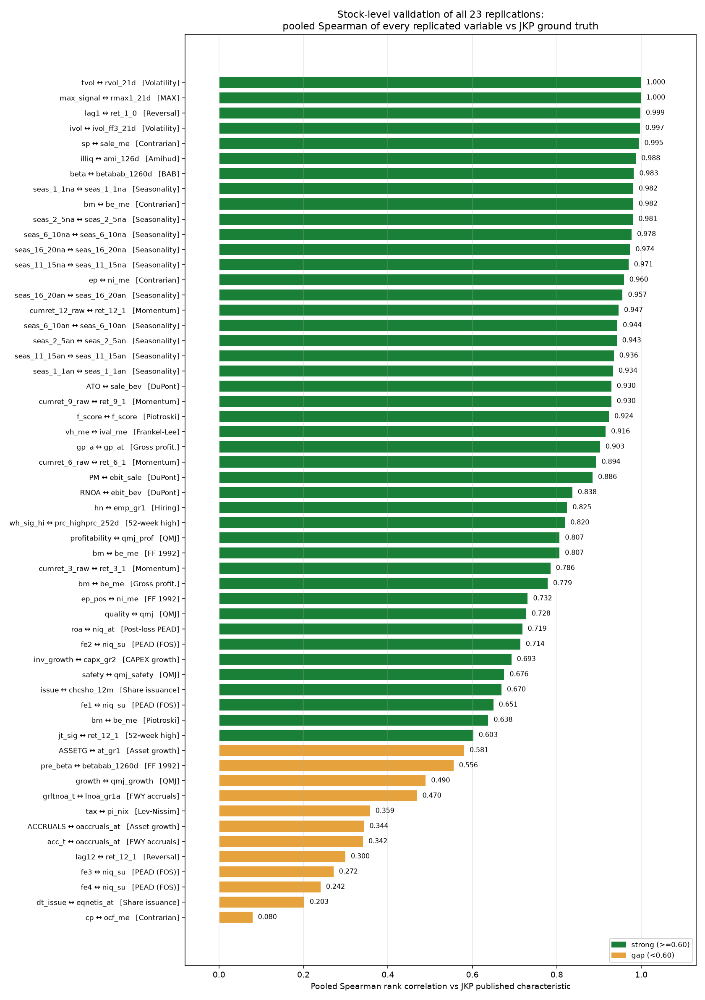
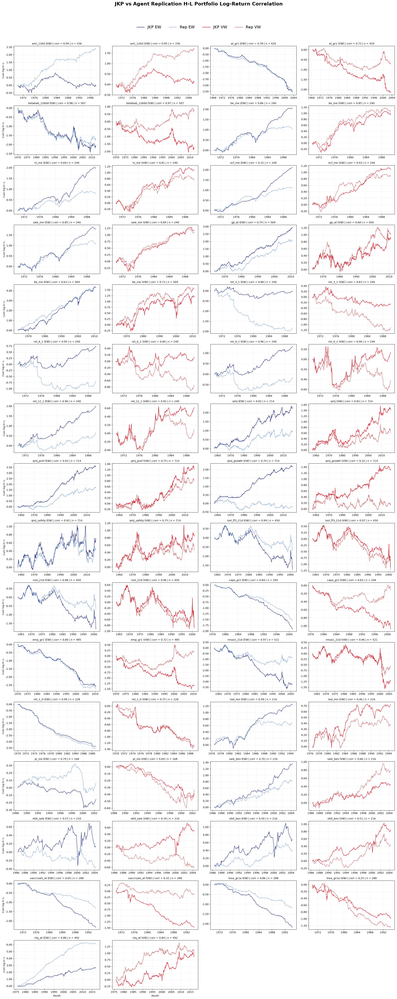

# replication-crate
This repo contains automated replications of 23 published finance papers from Jensen, Kelly, and Pedersen (2023), [*”Is There a Replication Crisis in Finance?”*](https://onlinelibrary.wiley.com/doi/full/10.1111/jofi.13249) (Journal of Finance). All replications were produced by the **rep-it-up** multi-agent system with no human intervention.

Each paper has a standalone folder with its implementation code (SQL + Python), a detailed report, and a scored summary benchmarking our results against the original findings. Data panels are excluded; the SQL documents every construction step so that results can be rebuilt from the source database.

JKP have open-sourced their replication code and data for a superset of the papers covered here. We treat their published factor library as ground truth and compare our replications against theirs in the [Test](#test) section below.

## Papers

<!-- BEGIN PAPER LIST -->

- [Betting Against Beta (Frazzini & Pedersen, 2014)](replications/betting_against_beta/)
- [Lakonishok, Shleifer & Vishny (1994) — "Contrarian Investment, Extrapolation, and Risk"](replications/contrarian_investment/)
- [The Cross-Section of Volatility and Expected Returns (Ang, Hodrick, Xing & Zhang 2006)](replications/cross_section_of_volatility/)
- [Earnings Releases, Anomalies, and the Behavior of Security Returns (Foster, Olsen & Shevlin 1984)](replications/earnings_releases_anomalies/)
- [Amihud (2002), "Illiquidity and stock returns: cross-section and time-series effects"](replications/illiquidity_and_stock_returns/)
- [Quality minus junk (Asness, Frazzini, Pedersen 2019)](replications/quality_minus_junk/)
- [Returns to Buying Winners and Selling Losers: Implications for Stock Market Efficiency](replications/returns_to_buying_winners/)
- [Seasonality in the Cross Section of Stock Returns: The International Evidence (Heston & Sadka 2010, JFQA)](replications/seasonality_international_evidence/)
- [Pontiff & Woodgate (2008), "Share Issuance and Cross-sectional Returns", *Journal of Finance* 63(2)](replications/share_issuance_and_cross_sectional_returns/)
- [The 52-Week High and Momentum Investing (George & Hwang 2004, Journal of Finance)](replications/the_52_week_high_and_momentum_investing/)
- [The Cross-Section of Expected Stock Returns (Fama & French 1992, *Journal of Finance* 47(2))](replications/the_cross_section_of_expected_stock_returns/)
- [The Other Side of Value: The Gross Profitability Premium (Novy-Marx 2013, JFE)](replications/the_other_side_of_value/)
- [Asset Growth and the Cross-Section of Stock Returns (Cooper, Gulen & Schill 2008)](replications/asset_growth_and_the_cross_section_of_stock_returns/)
- [Piotroski (2000), "Value Investing: The Use of Historical Financial Statement Information to Separate Winners from Losers Among Value Stocks" (Journal of Accounting Research, Vol. 38)](replications/value_investing_f_score/)
- [Anderson & Garcia-Feijoo (2006), "Empirical Evidence on Capital Investment, Growth Options, and Security Returns"](replications/anderson_garciafeijoo_2006_empirical_evidence_on_capital_investment_growth_optio/)
- [Balakrishnan, Bartov & Faurel (2010), "Post Loss/Profit Announcement Drift"](replications/balakrishnan_bartov_faurel_2010_post_loss_profit_announcement_drift/)
- [Fairfield, Whisenant & Yohn (2003), "Accrued Earnings and Growth: Implications for Future Profitability and Market Mispricing"](replications/fairfield_whisenant_yohn_2003_accrued_earnings_and_growth/)
- [Bali, Cakici & Whitelaw (2011), "Maxing Out: Stocks as Lotteries and the Cross-Section of Expected Returns"](replications/bali_cakici_whitelaw_2011_maxing_out_stocks_as_lotteries_and_the_cross_section_o/)
- [Belo, Lin & Bazdresch (2014), "Labor Hiring, Investment, and Stock Return Predictability"](replications/belo_lin_bazdresch_2014_labor_hiring_investment_and_stock_return_predictability/)
- [Frankel & Lee (1998), "Accounting Valuation, Market Expectation, and Cross-Sectional Stock Returns"](replications/frankel_lee_1998_accounting_valuation_market_expectation_and_cross_sectional_sto/)
- [Jegadeesh (1990), "Evidence of Predictable Behavior of Security Returns"](replications/jegadeesh_1990_evidence_of_predictable_behavior_of_security_returns/)
- [Lev & Nissim (2004), "Taxable Income, Future Earnings, and Equity Values"](replications/lev_nissim_2004_taxable_income_future_earnings_and_equity_values/)
- [Soliman (2008), "The Use of DuPont Analysis by Market Participants"](replications/soliman_2007_the_use_of_dupont_analysis_by_market_participants/)

<!-- END PAPER LIST -->

## Test

### Stock-Level Validation

We compare our replicated characteristics against JKP's published stock-level data at the stock level. For each (firm, period) where both our replication and JKP's published data are non-missing, we compute the pooled **Spearman rank correlation** across all observations. The comparison follows the JKP authors' own SAS-vs-Python translation benchmark (0.994), documented in their [release notes](https://github.com/bkelly-lab/jkp-data).

### Portfolio-Level Test

We also compare our replicated characteristics at the portfolio level. For each factor we compute the cumulative log H-L (high-minus-low) return of our replicated series and the JKP-published series under both equal-weighted (EW) and value-weighted (VW) portfolios, and report the **Pearson correlation** across the overlapping months.

## Resources

- [Jensen, Kelly, and Pedersen (2023), "Is There a Replication Crisis in Finance?"](https://onlinelibrary.wiley.com/doi/full/10.1111/jofi.13249)
- [published global factor library](https://jkpfactors.com/)
- [code for how JKP replicated all papers](https://github.com/bkelly-lab/ReplicationCrisis)
- [code for the global factor data pipeline](https://github.com/bkelly-lab/jkp-data)
- [variable name definitions](https://jkpfactors-data.s3.amazonaws.com/documents/Documentation.pdf)