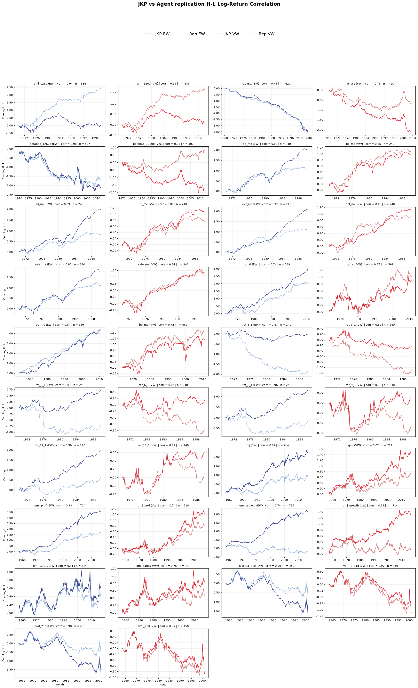

# replication-crate

This repo contains replications of published academic finance papers, done by a multi-agent system (rep-it-up). Each paper has a stand-alone folder with implementation code (SQL + Python), a detailed report and a scored summary comparing our results against the paper's original findings.

Data panels are excluded; the SQL in the src/ directory documents how every dataset is constructed and results can be rebuilt from the source database.

## Papers

<!-- BEGIN PAPER LIST -->

### Harness 1.0 (base)

- [Betting Against Beta (Frazzini & Pedersen, 2014)](replications/betting_against_beta/)
- [Lakonishok, Shleifer & Vishny (1994) — "Contrarian Investment, Extrapolation, and Risk"](replications/contrarian_investment/)
- [The Cross-Section of Volatility and Expected Returns (Ang, Hodrick, Xing & Zhang 2006)](replications/cross_section_of_volatility/)
- [Earnings Releases, Anomalies, and the Behavior of Security Returns (Foster, Olsen & Shevlin 1984)](replications/earnings_releases_anomalies/)
- [Amihud (2002), "Illiquidity and stock returns: cross-section and time-series effects"](replications/illiquidity_and_stock_returns/)
- [Quality minus junk (Asness, Frazzini, Pedersen 2019)](replications/quality_minus_junk/)
- [Returns to Buying Winners and Selling Losers: Implications for Stock Market Efficiency](replications/returns_to_buying_winners/)
- [Seasonality in the Cross Section of Stock Returns: The International Evidence (Heston & Sadka 2010, JFQA)](replications/seasonality_international_evidence/)
- [Pontiff & Woodgate (2008), "Share Issuance and Cross-sectional Returns", *Journal of Finance* 63(2)](replications/share_issuance_and_cross_sectional_returns/)
- [The 52-Week High and Momentum Investing (George & Hwang 2004, Journal of Finance)](replications/the_52_week_high_and_momentum_investing/)
- [The Cross-Section of Expected Stock Returns (Fama & French 1992, *Journal of Finance* 47(2))](replications/the_cross_section_of_expected_stock_returns/)
- [The Other Side of Value: The Gross Profitability Premium (Novy-Marx 2013, JFE)](replications/the_other_side_of_value/)
- [Asset Growth and the Cross-Section of Stock Returns (Cooper, Gulen & Schill 2008)](replications/asset_growth_and_the_cross_section_of_stock_returns/)
- [Piotroski (2000), "Value Investing: The Use of Historical Financial Statement Information to Separate Winners from Losers Among Value Stocks" (Journal of Accounting Research, Vol. 38)](replications/value_investing_f_score/)

### Harness 1.1

- [Anderson & Garcia-Feijoo (2006), "Empirical Evidence on Capital Investment, Growth Options, and Security Returns"](replications/anderson_garciafeijoo_2006_empirical_evidence_on_capital_investment_growth_optio/)
- [Balakrishnan, Bartov & Faurel (2010), "Post Loss/Profit Announcement Drift"](replications/balakrishnan_bartov_faurel_2010_post_loss_profit_announcement_drift/)
- [Fairfield, Whisenant & Yohn (2003), "Accrued Earnings and Growth: Implications for Future Profitability and Market Mispricing"](replications/fairfield_whisenant_yohn_2003_accrued_earnings_and_growth/)

### Harness 1.2

- [Bali, Cakici & Whitelaw (2011), "Maxing Out: Stocks as Lotteries and the Cross-Section of Expected Returns"](replications/bali_cakici_whitelaw_2011_maxing_out_stocks_as_lotteries_and_the_cross_section_o/)
- [Belo, Lin & Bazdresch (2014), "Labor Hiring, Investment, and Stock Return Predictability"](replications/belo_lin_bazdresch_2014_labor_hiring_investment_and_stock_return_predictability/)
- [Frankel & Lee (1998), "Accounting Valuation, Market Expectation, and Cross-Sectional Stock Returns"](replications/frankel_lee_1998_accounting_valuation_market_expectation_and_cross_sectional_sto/)

### Harness 1.3

- [Jegadeesh (1990), "Evidence of Predictable Behavior of Security Returns"](replications/jegadeesh_1990_evidence_of_predictable_behavior_of_security_returns/)
- [Lev & Nissim (2004), "Taxable Income, Future Earnings, and Equity Values"](replications/lev_nissim_2004_taxable_income_future_earnings_and_equity_values/)
- [Soliman (2008), "The Use of DuPont Analysis by Market Participants"](replications/soliman_2007_the_use_of_dupont_analysis_by_market_participants/)

<!-- END PAPER LIST -->

## JKP test

We conducted a test against existing factor return data from jkpfactors.com to benchmark our replicated factor returns against the official JKP factor library. For each factor we compute the cumulative log H-L (high-minus-low) return of our replicated series and the JKP-published series under both equal-weighted (EW) and value-weighted (VW) portfolios, and report the Pearson correlation across the overlapping months. High correlations indicate that our pipeline reproduces the published JKP factors closely, while divergences flag implementation differences worth investigating.

Refer to https://jkpfactors-data.s3.amazonaws.com/documents/Documentation.pdf for variable name definitions.
